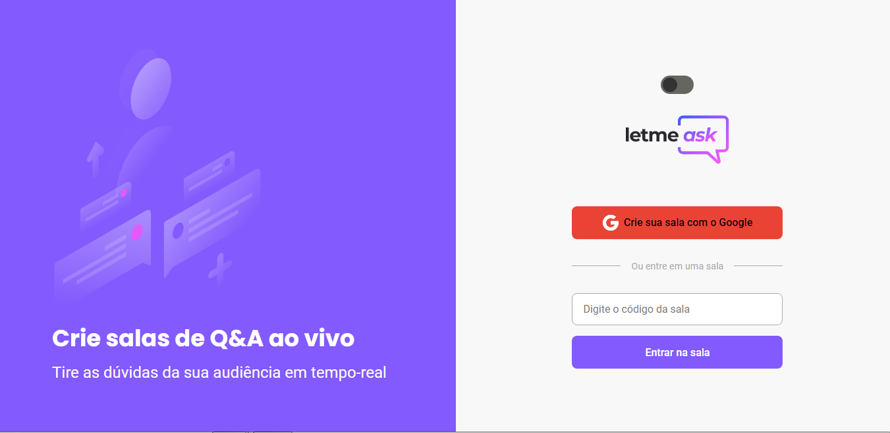

<h1 align="center">
  
</h1>

  <a href="#-tecnologias">Tecnologias</a>&nbsp;&nbsp;&nbsp;|&nbsp;&nbsp;&nbsp;
  <a href="#-projeto">Projeto</a>&nbsp;&nbsp;&nbsp;|&nbsp;&nbsp;&nbsp;
  <a href="#-layout">Layout</a>&nbsp;&nbsp;&nbsp;|&nbsp;&nbsp;&nbsp;
  <a href="#memo-licença">Licença</a>

 

  

 

  

## 🚀 Tecnologias

Esse projeto foi desenvolvido com as seguintes tecnologias:

- ReactJS
- Sass
- HTML
- CSS
- NodeJS

## 💻 Projeto

O Letmeask é uma aplicação de perguntas para ser utilizado durante lives, com várias funcionalidades como: classificação por like das perguntas, destaque da pergunta atualmente em resposta... entre outras.
Se desejar você pode utilizar a aplicação através [desse link](https://letmeask-project-3c098.web.app/)

## 🔖 Layout

Você pode visualizar o layout do projeto através [desse link](https://www.figma.com/file/u0BQK8rCf2KgzcukdRRCWh/Letmeask/duplicate). É necessário ter conta no [Figma](https://figma.com) para acessá-lo.

## :memo: Licença

Esse projeto está sob a licença MIT. Veja o arquivo [LICENSE](.github/LICENSE.md) para mais detalhes.

---

Feito com ♥ by Gleydson :wave:

## Usabilidade
Antes de iniciar o projeto baixe as dependências com npm install
Para iniciar o projeto localmente use npm start